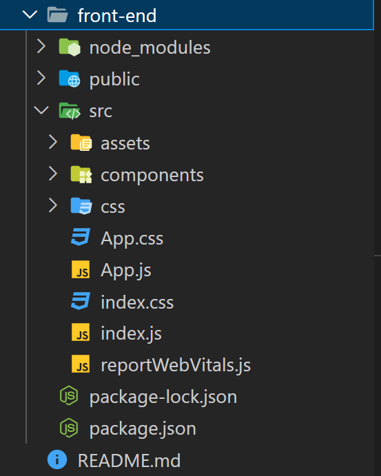
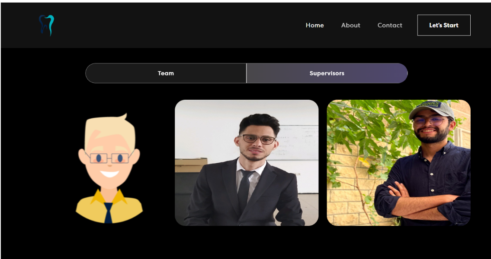
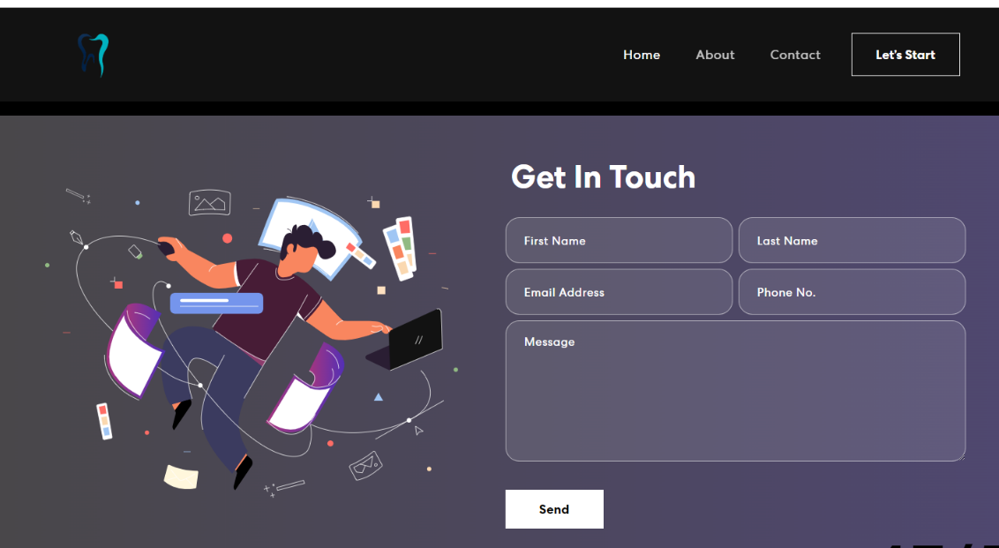

# Welcome to Our documentation for Deployment


## Fonctionnalités du Projet
La partie de déploiement de notre projet est une étape cruciale pour réaliser des prédictions sur des objets 3D au format .vtp ou .obj et les visualiser dans notre site web. Cette phase est le pivot central de notre système, permettant aux utilisateurs de tirer pleinement parti de la technologie 3D pour une expérience enrichissante.

Notre objectif principal est d'offrir aux utilisateurs la capacité de télécharger des fichiers 3D, de les soumettre à un processus de prédiction, puis de visualiser les résultats de manière interactive sur notre site web. Pour atteindre cet objectif, nous avons mis en place une architecture en deux parties : le backend et le frontend.

 **La partie backend** : assure le traitement des données, y compris la prédiction à l'aide du modèle MeshSegNet.

 **la partie frontend** :offre une interface conviviale pour les utilisateurs

## Technologies Utilisées

## Configuration et Installation
### 1. Configuration de l'environnement virtuel
Un environnement virtuel est un environnement Python isolé qui permet de gérer les
dépendances spécifiques à un projet sans interférer avec d'autres projets Python sur le
même système. Voici comment créer et configurer un environnement virtuel pour votre
projet:

#### **-Installation de l'outil  `virtualenv`:**

Si vous n'avez pas déjà virtualenv installé sur votre système, vous pouvez l'installer en utilisant pip, qui est l'outil de gestion de paquets Python.
Ouvrez un terminal et exécutez la commande suivante :
` pip install virtualenv `

#### **-Création de l'environnement virtuel:**

Dans le répertoire racine de votre projet, créez
un environnement virtuel en utilisant virtualenv.
Remplacez **nom_env** par le nom que vous
souhaitez donner à votre environnement virtuel : virtualenv nom_env. Cela créera un dossier
avec le nom de votre environnement virtuel contenant une installation Python propre et
isolée

#### **-Activation de l'environnement virtuel:** 
Après avoir créé l'environnement virtuel, vous
devez l'activer. Selon votre système d'exploitation, la commande d'activation varie.<br>
**Sur Windows: `nom_env\Scripts\activate.`**<br>
**Sur macOS ou Linux: `source nom_env/bin/activate`**
### 2. Installation Backend
#### **-Installation de Flask:** 
Dans l'environnement virtuel activé avant, utiliser lacommande suivante pour installer flask: `pip install flask`
#### **-Installation des dépendances Python:**
 Utilisez pip pour installer les packages
Python nécessaires. Dans ce contexte, vous aurez probablement besoin de packages tels
que **Flask**, **NumPy**, **Torch**, **vedo**, **Pandas**, **Spicy**... Exemple: `pip install flask numpy torch`.

Pour lancer le serveur Backend, il faut accéder au dossier de backend, et puis exécuter la
commande `python app.py`
### 3. Installation Frontend
#### **- Installation de Node.js et npm**
 Premièrement, il faut télécharger le fichier Windows
Installer(.msi) ou macOS Installer(.pkg), puis terminer le processus d' installation et la lancer.

Pour lancer le serveur Frontend, il faut accéder au dossier de fronted et exécuter la
commande `npm start`.
## Frontend
Cette partie est consacré pour entammer la prtie Fontend de notre projet pour aider mieux à sa comprehension
### 1.Structure du Frontend

l'arbrorescente du Frontend est la suivante:


  
  

#### Vue d'ensemble
-node modules: 
  Ce répertoire contient toutes les dépendances externes installées pour le projet à l'aide de npm ou yarn. 
      ``` 
       npm install
     ```

-public: 
Ce répertoire contient les fichiers statiques et publics du projet, tels que les fichiers HTML de base.


-src: 
C'est le répertoire principal du projet contenant le code source.

assets: Ce répertoire contient des fichiers statiques utilisés dans l'application, tels que les polices (font) et les images (img).

components: Ce répertoire contient des composants React réutilisables utilisés pour construire l'interface utilisateur de l'application.

About.js: Un composant qui affiche des informations sur l'application ou l'équipe derrière le projet.

Banner.js: Un composant qui affiche  un texte  et une image animé. 

Card.js: Un composant qui représente une carte ou un élément de contenu pouvant être utilisé pour afficher des informations.

Contact.js: Un composant qui affiche un formulaire pour contacter l'équipe de développement.

Footer.js : Un composant qui représente le pied de page de l'application, généralement avec des liens et des informations de copyright.

NavBar.js: Un composant qui représente la barre de navigation de l'application, généralement avec des liens vers les différentes sections du site.

Prediction.js: Un composant qui permet à l'utilisateur de télécharger un fichier, de le téléverser vers un serveur, d'obtenir une prédiction, de télécharger le résultat et d'afficher le résultat avec le composant Vis.

Qui utilise le Hooks `UseState` pour gérer plusieurs états, tels que selectedFile, predictionSuccess, predictionMessage, etc. Ces états sont utilisés pour suivre et mettre à jour l'état de la prédiction.
            Dans ce composant il existe 3 fonctions fondamentales :

               1- `HandleFileChange`: appelé lorsque l'utilisateur sélectionne le fichier a segmenté et elle met à jour l'état `selectedFile` avec le fichier sélectionné.

               2- `HandleUpload `:est appelée lorsque l'utilisateur clique sur le bouton "Predict". Elle envoie le fichier téléchargé vers un serveur distant à l'aide d'une requête HTTP POST en utilisant la bibliothèque axios


                ``` 
                  const response = await axios.post('http://127.0.0.1:5000/predict', formData, {
                 responseType: 'blob',
                  });
              //  En cas de réussite, elle met à jour les états predictionSuccess, predictionMessage, et predictionFileURL pour afficher le résultat de la prédiction.
                 ```

              3- `handleDownload`: appelée lorsque l'utilisateur clique sur le bouton "Download the VTP file". Elle permet de télécharger le fichier résultant de la prédiction.

et en fin la fonction  `scrollToVis ` : Cette fonction fait défiler la page vers le composant Vis qui affiche la visualisation résultante à l'aide de VTk.js
                  
            
vis.js : Un composant chargé pour la visualisation des données résultantes de la prédiction, en utilisant la bibliothèque vtk.js à partir des données reçues.
           
 En résumé, ce composant  offre des fonctionnalités pour personnaliser la visualisation, ajuster les paramètres de représentation,  à l'aide de divers fonction telle que **createViewer** , **createPipeline** , **updateRepresentation**
            ** , **updateOpacity** .. :

            1- `createViewer`: Cette fonction a pour but de créer un conteneur pour la visualisation en utilisant la fonction vtkFullScreenRenderWindow de la bibliothèque vtk.js. 

             2- `createPipeline`:  Cette fonction est responsable de la création du pipeline de visualisation. Cela implique le chargement des données résultantes de la prédiction, la création d'une table de correspondance des couleurs.

            1- `updateOpacity `: Cette fonction permet à l'utilisateur de régler l'opacité de la visualisation. Cela peut être utile pour ajuster la transparence des objets visualisés.. 
            


### 2.Interface Utilisateur

##### Page d'Accueil

  
  

##### Page d'informations
 
  

  

##### Page de contact

  


##### Page de Segmentation.

  
  
  


## Backend 

### Structure du Backend 
### API pour la Prédiction


## Visualisation 3D avec VTK.js
